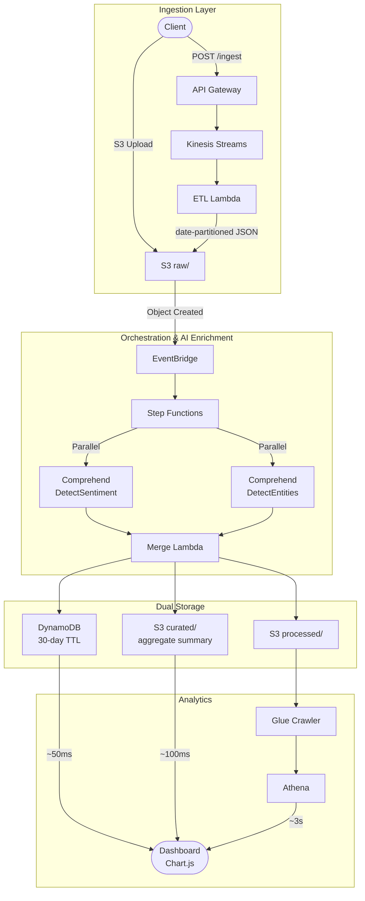

# AI-Powered Serverless Data Pipeline


**33 unit tests · 96% coverage · 0% error rate (1,000-event load test) · $12/month actual AWS cost · 6 CloudWatch alarms · CI/CD via GitHub OIDC**

A production-grade, serverless data pipeline built on AWS that ingests, enriches, and analyzes data using AI/ML services. This project demonstrates modern cloud architecture patterns, Infrastructure as Code (IaC), and AI/ML integration.

## Overview

This pipeline processes both **batch** and **streaming** data, enriching it with AWS AI services (Comprehend, SageMaker, Rekognition), and provides analytics through a dual storage strategy:
- **Hot Storage**: DynamoDB for low-latency recent data queries
- **Historical Storage**: S3 Data Lake for long-term analytics with Athena

### Key Features

- **Multi-Modal Ingestion**: REST API (streaming) + S3 batch uploads
- **AI/ML Enrichment**: Sentiment analysis, entity extraction, anomaly detection, image labeling
- **Serverless Architecture**: Zero server management, auto-scaling, pay-per-use
- **Dual Storage Strategy**: Real-time queries (DynamoDB) + Historical analytics (S3 + Athena)
- **Infrastructure as Code**: 100% Terraform-managed, multi-environment support
- **Production-Ready**: Error handling, monitoring, DLQ replay, security best practices
- **CI/CD**: GitHub Actions with OIDC (no long-term credentials)

## Architecture



For full diagrams (sequence, state machine, storage tiers, API contract) see [docs/architecture.md](docs/architecture.md).

## Technology Stack

| Layer | Technologies |
|-------|-------------|
| **Infrastructure** | Terraform >= 1.11.0, AWS |
| **Compute** | Lambda (Python 3.11+), Step Functions |
| **Ingestion** | API Gateway, Kinesis Data Streams, EventBridge |
| **AI/ML** | Comprehend (sentiment, entities) |
| **Storage** | S3 (Data Lake), DynamoDB |
| **Analytics** | Glue, Athena, Chart.js Dashboard |
| **Observability** | CloudWatch, X-Ray, SQS DLQs |
| **CI/CD** | GitHub Actions (OIDC) |

## AI-Assisted Development

This project was built using **Claude Code** as an AI coding assistant for infrastructure scaffolding, test generation, and documentation structure.

Every generated output was reviewed, tested, and in several cases corrected or redesigned based on real failures encountered during implementation:

- **DecimalEncoder** (`lambdas/merge/merge_handler.py`) — Athena queries were returning `HIVE_CURSOR_ERROR` due to Python floats serializing as scientific notation. The AI-generated handler used standard `json.dumps`. I diagnosed the root cause and built a custom `DecimalEncoder` class to normalize float representation before S3 writes.

- **IAM least-privilege audit** — Initial IAM policies were over-permissive (bucket-level `s3:*`). During a dedicated security review I scoped every policy to the minimum required action and resource (e.g., S3 writes restricted to `raw/*`, `s3:PutObjectAcl` explicitly removed). Findings documented in `docs/errorlog.md`.

- **Comprehend region pivot** — AI scaffolding placed Comprehend calls in `us-west-1` (same as the Terraform state bucket). Comprehend is not available in that region. I caught this during integration testing, diagnosed the cause, and redesigned the architecture so all application resources run in `us-west-2` with state backend isolated in `us-west-1`.

- **CI/CD pipeline debugging** — The GitHub Actions OIDC workflow required 14+ iterations to get working end-to-end: IAM permission gaps only discoverable at runtime, tflint plugin rate limiting, deprecated action replacement. This debugging is traceable in the PR #1 commit history.

The AI accelerated scaffolding and boilerplate. The architectural decisions, debugging, and security hardening are my own.

## Repository Structure

```
AI-DP/
├── bootstrap/            # Terraform config for S3 state bucket
├── envs/                 # Environment-specific Terraform configs
│   ├── dev/             # Development environment
│   ├── stg/             # Staging environment
│   └── prod/            # Production environment
├── modules/             # Reusable Terraform modules
│   ├── data_lake/           # S3 buckets (raw/processed/curated) ✅
│   ├── ingestion_stream/    # API Gateway, Kinesis, EventBridge ✅
│   ├── step_functions/      # State machine + Comprehend AI ✅
│   ├── hot_store/           # DynamoDB tables ✅
│   ├── orchestration/       # Merge Lambda ✅
│   ├── analytics/           # Glue crawler, Athena ✅
│   └── observability/       # CloudWatch dashboards, alarms (Phase 9)
├── lambdas/             # Python Lambda function code
│   ├── etl/            # Kinesis consumer (normalize & write to S3)
│   ├── merge/          # Merge AI outputs, write to storage
│   └── replay/         # DLQ replay utility (Phase 9)
├── dashboard/          # Browser-based analytics dashboard ✅
│   ├── index.html     # Main HTML file
│   ├── styles.css     # Dark theme styling
│   └── app.js         # Chart.js + AWS SDK integration
└── docs/               # Project documentation
```

## Quick Start

### Prerequisites

- **Terraform** >= 1.11.0 ([Download](https://www.terraform.io/downloads))
- **AWS CLI** configured with credentials
- **Python** 3.11+ (for Lambda development)
- **Git**

### 1. Clone the Repository

```bash
git clone https://github.com/<your-username>/AI-DP.git
cd AI-DP
```

### 2. Configure AWS Credentials

```bash
aws configure
# Enter your AWS Access Key ID, Secret Key, and default region
```

### 3. Bootstrap Terraform Backend (First-Time Setup)

Create the S3 bucket for Terraform state:

```powershell
terraform -chdir=bootstrap init
terraform -chdir=bootstrap apply
```

This creates an S3 bucket with:
- Versioning enabled
- Encryption at rest (SSE-S3)
- Native state locking (Terraform >= 1.11.0)

### 4. Initialize Development Environment

```powershell
terraform -chdir=envs/dev init
terraform -chdir=envs/dev plan
terraform -chdir=envs/dev apply
```

### 5. Deploy to Staging/Production

```powershell
# Staging
terraform -chdir=envs/stg init
terraform -chdir=envs/stg apply

# Production
terraform -chdir=envs/prod init
terraform -chdir=envs/prod apply
```

## Development Workflow

### Terraform Commands

```powershell
# Format Terraform files
terraform -chdir=envs/dev fmt -recursive

# Validate configuration
terraform -chdir=envs/dev validate

# Plan changes
terraform -chdir=envs/dev plan -out=plan.out

# Apply changes
terraform -chdir=envs/dev apply plan.out

# Destroy resources (use with caution!)
terraform -chdir=envs/dev destroy
```

### Python Lambda Development

```powershell
# Navigate to Lambda function directory
cd lambdas/etl

# Create virtual environment
python -m venv venv
.\venv\Scripts\activate  # Windows
source venv/bin/activate # Linux/Mac

# Install dependencies
pip install -r requirements.txt

# Run tests
pytest lambdas/ --cov --cov-report=term-missing
```

## Testing

```powershell
# Unit tests (33 tests, 96% coverage)
pytest lambdas/etl/ --cov=etl_handler --cov-report=term-missing
pytest lambdas/merge/ --cov=merge_handler --cov-report=term-missing

# Run all Lambda tests with combined coverage report
pytest lambdas/ --cov --cov-report=term-missing

# Integration tests
# See scripts/ for test utilities (load_test.py sends 1000 events via Kinesis)
```

## Project Status

**Status**: ✅ **PROJECT COMPLETE** — All 10 phases done (2026-04-05)

See [`docs/roadmap.md`](docs/roadmap.md) for full phase history and implementation details.

### ✅ Completed Phases

**Phase 0: Bootstrap Infrastructure**
- S3 state bucket with native locking (Terraform >= 1.11.0)
- All environments initialized (dev, stg, prod)

**Phase 1: Data Lake Foundation**
- S3 bucket: `ai-dp-data-lake-dev-us-west-2`
- Three-layer architecture (raw/processed/curated)
- Lifecycle policies, versioning, encryption

**Phase 2: Streaming Ingestion**
- API Gateway HTTP API + Kinesis Data Streams
- ETL Lambda function (Python 3.11)
- Idempotent writes (Kinesis sequence numbers as S3 filenames)
- End-to-end tested: API → Kinesis → Lambda → S3

**Phase 3: Batch Ingestion EventBridge**
- EventBridge rule detects S3 uploads to raw/ layer
- Filtered event pattern (prevents infinite loops)

**Phase 4: Step Functions & EventBridge Wiring**
- State machine deployed: `ai-dp-dev-orchestrator`
- EventBridge → Step Functions integration
- End-to-end batch path tested and verified

**Phase 5: DynamoDB Hot Store**
- DynamoDB table deployed: `ai-dp-dev-enriched-data`
- On-demand billing, TTL (30 days), PITR enabled
- GSI for time-based queries

**Phase 6: AI Enrichment Services**
- AWS Comprehend integrated (sentiment + entity detection)
- Parallel execution in Step Functions
- Real-time AI enrichment operational

**Phase 7: Merge Lambda & Complete Orchestration**
- Merge Lambda deployed: `ai-dp-dev-merge`
- Dual storage strategy: S3 processed/ + DynamoDB
- End-to-end pipeline fully operational (streaming + batch)

**Phase 8: Analytics & Query Layer**
- Glue Crawler + Athena: SQL queries on S3 data lake
- Browser-based dashboard (HTML/CSS/JS + Chart.js)
- Three-tier data strategy: Curated S3 (~100ms) + DynamoDB (~50ms) + Athena (~3s)
- Optimized dashboard: Sentiment chart from pre-aggregated Curated S3 for instant loading
- Responsive design: Real-time metrics, sentiment charts, entity analysis
- Zero dependencies: Runs directly from file system or S3 static hosting

**Phase 9: Production Hardening** ✅ (100% — 7/7 tasks complete)
- ✅ Lambda unit tests (33 tests, 96% coverage)
- ✅ Load testing (1000 events, 0% errors)
- ✅ CloudWatch Dashboard (8 widgets) + 6 Alarms + SNS
- ✅ Security Review (IAM audit, KMS, tfsec — 0 critical findings)
- ✅ Cost Optimization ($12/month actual, 76% under $50 budget)
- ✅ Architecture Documentation (`docs/architecture.md`) — Mermaid diagrams, sequence flows, API contract

**Phase 10: CI/CD Pipeline** ✅ (100% — 6/6 tasks complete)
- ✅ GitHub Actions OIDC role (`ai-dp-dev-github-actions`) — least-privilege IAM, Terraform-managed
- ✅ CI workflow (`.github/workflows/ci.yml`) — fmt/validate/tflint/tfsec/plan on every PR
- ✅ Deploy workflow (`.github/workflows/deploy.yml`) — `terraform apply` on merge to main
- ✅ GitHub Environment (`dev`) with protection rules
- ✅ Workflows tested end-to-end
- ✅ CI/CD documentation (`docs/cicd.md`)

## Documentation

- **[Interview Walkthrough](docs/explained.md)**: How to explain this project in interviews
- **[Error Log](docs/errorlog.md)**: Errors encountered, root causes, and fixes
- **[Architecture](docs/architecture.md)**: Full diagrams, sequence flows, key decisions, API contract
- **[Data Flow](docs/data_flow.md)**: End-to-end data flow with payloads and retention details
- **[CI/CD](docs/cicd.md)**: CI/CD pipeline design and workflow documentation
- **[Roadmap](docs/roadmap.md)**: Implementation phases and tasks
- **[Project Overview](docs/ai-dp%20overview%20notion.md)**: Comprehensive architecture guide

## Design Principles

1. **NO HARDCODING**: All solutions are generic and pattern-based
2. **ROOT CAUSE, NOT BANDAID**: Fix underlying structural issues
3. **DATA INTEGRITY**: Use consistent, authoritative data sources
4. **SECURITY-FIRST**: OIDC authentication, least-privilege IAM, no long-term credentials
5. **ENVIRONMENT ISOLATION**: Strict separation between dev/staging/prod

## CI/CD Pipeline

Two GitHub Actions workflows handle the full CI/CD lifecycle:

- **CI** (`.github/workflows/ci.yml`): Runs on every PR — fmt, validate, tflint, tfsec, plan. Posts plan output as PR comment.
- **Deploy** (`.github/workflows/deploy.yml`): Runs on merge to `main` — plan + `terraform apply`. Posts plan to job summary.

**Authentication:** GitHub OIDC — no long-term AWS credentials stored anywhere. See [`docs/cicd.md`](docs/cicd.md) for full documentation.

## Cost Optimization

- S3 lifecycle policies (IA → Glacier → expiration)
- DynamoDB on-demand pricing + TTL auto-cleanup
- Athena partition pruning (90%+ cost reduction)
- Kinesis single-shard for dev (scale as needed)
- Separate Athena results bucket with 7-day lifecycle

## Security

- All data encrypted at rest (S3 SSE-AES256, DynamoDB)
- TLS/HTTPS enforced via bucket policies
- IAM least-privilege roles (scoped to specific prefixes)
- Public access blocked on all S3 buckets
- SQS DLQs for error handling and retry
- Point-in-time recovery enabled on DynamoDB

## Contributing

This is a personal portfolio project. Contributions, suggestions, and feedback are welcome!

1. Fork the repository
2. Create a feature branch (`git checkout -b feature/amazing-feature`)
3. Commit your changes (`git commit -m 'Add amazing feature'`)
4. Push to the branch (`git push origin feature/amazing-feature`)
5. Open a Pull Request

## License

This project is licensed under the MIT License - see the LICENSE file for details.

## Acknowledgments

- AWS Architecture Center for best practices
- HashiCorp Terraform documentation
- AWS Serverless examples and patterns

---

**Built with AWS, Terraform, and Python** | **Portfolio Project for Cloud Engineering Roles**
