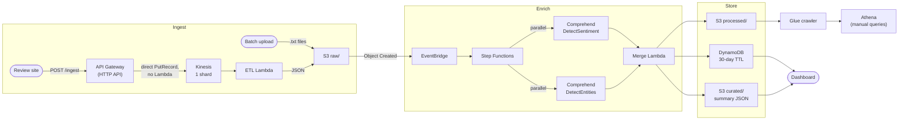

# AI-DP: Serverless Review Sentiment Pipeline

A serverless AWS pipeline, built with Terraform, that takes text from two sources (an HTTP API and S3 file uploads), scores sentiment and named entities with Amazon Comprehend, and stores the results for a live dashboard and SQL queries.

**The problem it models:** a company collects product reviews in two ways. Customers post reviews on its site as they happen, and someone on the team gathers reviews from elsewhere online and uploads them in batches. Both should end up in one place, scored the same way.

## Architecture



Streaming reviews hit API Gateway, which writes straight into Kinesis through a service integration with no Lambda in between. The ETL Lambda reads from Kinesis, validates and normalizes each event, and writes it to `raw/` as JSON. Batch uploads land in `raw/` directly as plain text. Both paths meet at that point: an EventBridge rule on `raw/` starts one Step Functions execution per file. The execution calls Comprehend's sentiment and entity APIs in parallel, then the merge Lambda writes the result to S3 `processed/` (for Athena), DynamoDB (for the dashboard's recent-events table), and a running summary in `curated/` (for the dashboard's totals and chart).

## Tech stack

| Piece | Why I chose it |
|---|---|
| **Terraform** (S3 backend, native lockfile) | Everything is defined in code across 9 modules. State lives in S3 with `use_lockfile`, so no DynamoDB lock table. |
| **API Gateway HTTP API** | It can write to Kinesis with no code through the `Kinesis-PutRecord` integration. |
| **Kinesis Data Streams** | Buffers bursts in front of the Lambda. I'd never used it and wanted the experience. At this volume, SQS would have been enough. |
| **Step Functions** | Calls Comprehend through its SDK integration, so there's no Lambda or cold start for that step. Runs sentiment and entities in parallel, and shows each state's input and output, which is how I debugged my JSONPath. |
| **Amazon Comprehend** | Managed sentiment and entity detection, with no model to train or host. |
| **DynamoDB** | Small, short-lived (30-day TTL) data the dashboard can query newest-first through a GSI. |
| **S3 data lake** | `raw/` → `processed/` → `curated/` layers, each with its own lifecycle rules (IA, then Glacier, then expiry). |
| **Glue + Athena** | SQL over `processed/` for historical questions. Queried by hand; the dashboard doesn't call it. |
| **CloudWatch, X-Ray, SNS** | 6 alarms emailed through SNS, an 8-widget dashboard, and active tracing on both Lambdas. |
| **GitHub Actions + OIDC** | CI and deploy without stored AWS keys. |

## Design decisions and tradeoffs

- **Step Functions instead of chaining Lambdas.** The SDK integration removed a Lambda whose only job would have been calling Comprehend, and the per-state input/output view made debugging much faster. The tradeoff is a second language to learn (Amazon States Language and JSONPath).
- **Two stores for two jobs.** DynamoDB holds a small, expiring copy for fast dashboard reads. S3 holds everything long-term, cheaply, with lifecycle tiers. Every record is written to both, which means two writes that can partly fail. The merge Lambda writes S3 first, so DynamoDB failures still leave the record in S3.
- **Dashboard totals come from a pre-computed summary file**, not from counting DynamoDB items. The table query only returns the latest 50 records, and a full count would mean a table scan on every refresh.
- **Conditional writes instead of an atomic counter** for that summary (see Challenges). Claude suggested both. I chose ETag conditional writes because it was the smaller change. It makes lost updates rare, not impossible. A DynamoDB `ADD` counter is the right fix at higher write rates.
- **Provisioned Kinesis (1 shard) instead of on-demand.** One shard cost $11.16 in August 2026; on-demand billed about $29/month for the same near-zero traffic. The mode is a variable, so I can switch to on-demand for a load test and back.
- **No Athena on the dashboard.** The chart reads a small JSON file instead of paying Athena's latency and per-query cost on every page load.

## Challenges and fixes

| Problem | What I saw | Fix | Commit |
|---|---|---|---|
| **Comprehend isn't offered in us-west-1** | Step Functions failed with `UNSUPPORTED_OPERATION: This operation is not supported in this region`. | Moved all application resources to us-west-2 and left the state bucket in us-west-1. Moving the state bucket wouldn't have helped, because what mattered was where Comprehend runs. Lesson: check service availability by region before choosing one. | [`47e2bdd`](https://github.com/CloudMikey/ai-dp/commit/47e2bdd) |
| **Athena `HIVE_CURSOR_ERROR`** | Queries over `processed/` failed. Tiny confidence scores were being written in scientific notation (`3.68e-06`), which the OpenX JSON SerDe can't parse inside nested structs. | Wrote a custom JSON encoder that writes floats as plain decimals. I didn't log this in `docs/errorlog.md` at the time, which I'd do differently. | [`9d76251`](https://github.com/CloudMikey/ai-dp/commit/9d76251) |
| **Lost updates in the dashboard summary** | Sending test records, I saw 9 records stored but the summary reading 7. Concurrent merge Lambdas each read, changed, and rewrote the same S3 object, so later writes overwrote earlier ones. | Conditional `PutObject` (`IfMatch` on the ETag, `IfNoneMatch='*'` on create) with jittered retries. Re-ran the same test: 17 records, summary reads 17, with real `PreconditionFailed` retries in the logs. Also added `scripts/rebuild_summary.py` to recompute it from DynamoDB. | [`0716b71`](https://github.com/CloudMikey/ai-dp/commit/0716b71) |
| **Empty text previews for batch uploads** | Batch files are plain text, but the preview code assumed JSON. The parse error was swallowed by a broad `except`, so previews were silently blank. Unnoticed for months because only the streaming path had been tested. | Fall back to the raw body on `JSONDecodeError`. | [`0716b71`](https://github.com/CloudMikey/ai-dp/commit/0716b71) |
| **Kinesis bill jumped from ~$12 to ~$29/month** | I'd switched the stream to on-demand for a load test and never switched it back. I caught it on my bill. | Made the capacity mode a variable defaulting to provisioned, and reverted. | [`bec4044`](https://github.com/CloudMikey/ai-dp/commit/bec4044) |
| **Unneeded `s3:PutObjectAcl` on the ETL role** | Not found by me. An AI-assisted audit flagged it. | Verified the Lambda didn't need it and removed it. | [`b55a9ce`](https://github.com/CloudMikey/ai-dp/commit/b55a9ce) |
| **CI deploy role missing permissions** | Each `terraform plan` in CI failed on the next missing read permission. | Added them to the role's policy one at a time (the `ci: re-trigger after adding …` commits in PR #1). | [PR #1](https://github.com/CloudMikey/ai-dp/pull/1) |

## Security

- **No stored AWS keys in CI/CD.** GitHub Actions gets short-lived credentials through OIDC. The role's trust policy is limited to this repo (`repo:CloudMikey/ai-dp:*`).
- **The deploy role's permission policy is managed in the AWS Console, not Terraform.** I did this on purpose to get hands-on time with IAM in the Console. The downside is that the policy can't be reviewed or recreated from this repo. If I started over, it would be in Terraform from day one.
- **Pipeline IAM is scoped per role and per S3 prefix.** For example, ETL can only `PutObject` to `raw/*`, and merge can only `PutItem` to its one table. The remaining `Resource: "*"` statements are for actions AWS doesn't let you scope (Comprehend, X-Ray writes, Step Functions log delivery), and each has a comment saying so.
- **Encryption and access:** SSE-S3 on the data lake, KMS on Kinesis, TLS-only bucket policy, and S3 Block Public Access on.
- **State:** remote in S3, encrypted, with native locking. tfsec runs in CI. Accepted exceptions (mostly customer-managed KMS keys, skipped for cost in dev) are listed with reasons in `.tfsec.yml`.
- **Known gaps** (fine for a short-lived demo, not for real use):
  - The `/ingest` endpoint has no authentication or throttling.
  - The local dashboard uses static IAM user keys from a gitignored `config.js`. Cognito Identity Pools or a small backend API would replace them.
  - Early on I committed a binary Terraform plan file (`envs/dev/tfplan`). Plan files embed the full state, including resource ARNs and my account ID. I removed it and fixed the `.gitignore` rule that missed it in [`eb1472d`](https://github.com/CloudMikey/ai-dp/commit/eb1472d), but it is still in older commits.

## Cost

**$11.16 in August 2026**, from AWS Cost Explorer. It was about $29/month while the stream was accidentally left on-demand.

- **Kinesis is the whole bill.** The single provisioned shard is billed every hour whether or not data flows. Lambda, Step Functions, Comprehend, DynamoDB, and S3 all showed $0.00 at this volume.
- My account also shows $0.51 for Route 53, which isn't part of this project.
- A $50/month AWS Budget emails an alert before costs get out of hand.

## Deploy it

**Prerequisites:** Terraform >= 1.11 (CI uses 1.13.0), AWS CLI with admin-level credentials, Python 3.11, and an AWS account where Comprehend is available in us-west-2.

1. **Create the state bucket** (one time):
   ```bash
   cp bootstrap/terraform.tfvars.example bootstrap/terraform.tfvars   # set aws_account_id
   terraform -chdir=bootstrap init && terraform -chdir=bootstrap apply
   ```
2. **Point the dev environment at it:**
   ```bash
   cp "envs/dev/backend-dev.hcl copy.example" envs/dev/backend-dev.hcl   # set bucket = bootstrap output
   echo 'alarm_email = "you@example.com"' > envs/dev/terraform.tfvars
   ```
3. **GitHub OIDC provider:** `envs/dev/cicd.tf` looks up an existing GitHub OIDC provider in the account. In an account without one, `plan` fails. Create the provider first, or delete `cicd.tf` if you don't need CI/CD.
4. **Deploy:**
   ```bash
   terraform -chdir=envs/dev init -backend-config=backend-dev.hcl
   terraform -chdir=envs/dev apply
   ```
   Then confirm the SNS subscription email so the alarms can reach you.
5. **Try it:**
   ```bash
   curl -X POST "$(terraform -chdir=envs/dev output -raw api_gateway_invoke_url)" \
     -H "Content-Type: application/json" -H "X-Partition-Key: test" \
     -d '{"event_type":"review","event_timestamp":"2026-10-04T12:00:00Z","text":"Fast shipping, great product."}'
   aws s3 cp review.txt s3://$(terraform -chdir=envs/dev output -raw data_lake_bucket_name)/raw/batch/review.txt   # plain text, under 5,000 bytes
   ```

**Teardown:** both the data lake and the Athena results bucket have versioning on and no `force_destroy`, so `terraform destroy` fails until they're empty. Empty them first, including old versions (the S3 console's **Empty** button does this), then run `terraform -chdir=envs/dev destroy`, and destroy `bootstrap/` last.

## Limitations and what I'd change

- **On the streaming path, Comprehend scores the whole JSON envelope**, not just the review. The ETL Lambda writes the full event (timestamps, field names, Lambda name) to `raw/`, and Step Functions passes the whole file to Comprehend. Sentiment and entities are therefore computed partly on metadata. The dashboard filters out timestamp "entities" to hide the symptom. The fix is deciding what text each path sends before building it.
- **The merge Lambda's DLQ never receives anything.** Its `dead_letter_config` only applies to asynchronous invocations, and Step Functions calls it synchronously, so failures go to the state machine's `Catch` instead. The DLQ and its alarm should be removed. See [`docs/runbooks.md`](docs/runbooks.md).
- **No retries on the Comprehend steps**, so a throttled call fails the execution.
- **Batch files must be under 5,000 bytes** (Comprehend's sentiment limit), and nothing enforces that.
- **If I started over:** check which regions each service is available in before picking one, use SQS instead of Kinesis at this volume, decide what text each ingestion path sends to Comprehend before building, and put the CI deploy policy in Terraform from day one.

## How I used AI

I built this with Claude Code. It helped me plan the phases, wrote much of the Terraform and Python, and helped me debug. As a beginner on a project this size, I accepted more of its suggestions than I should have, and the Python and test suite are more elaborate than the project needed. I chose the services, ran every deployment, and found the bugs in the Challenges section by testing the pipeline myself. The `s3:PutObjectAcl` permission is the exception: an AI-assisted audit caught that one, not me.
