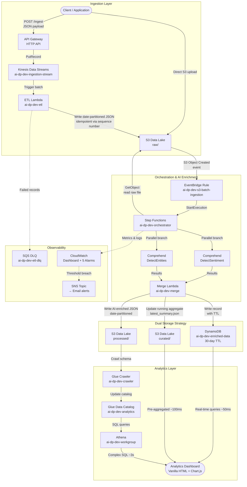
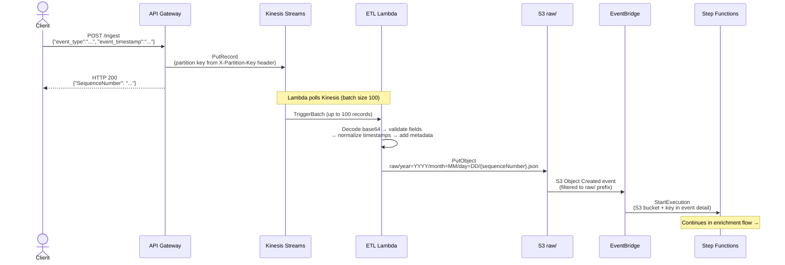
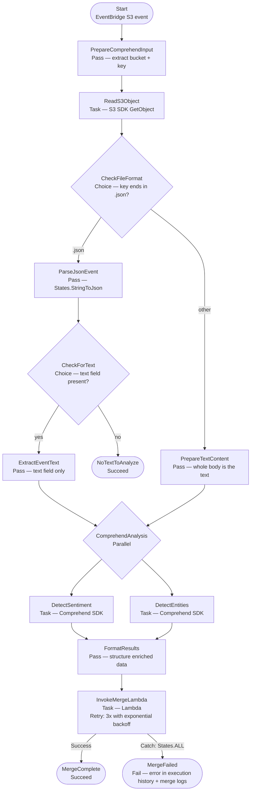
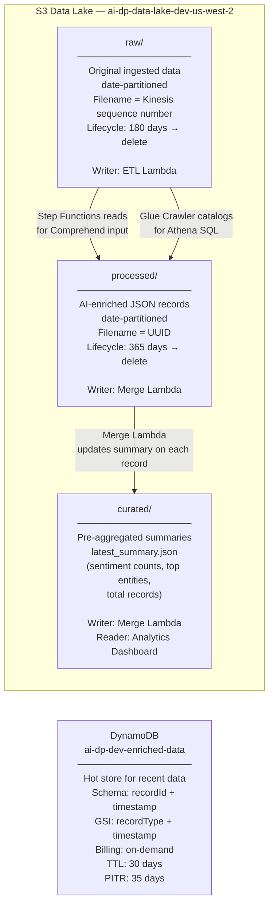
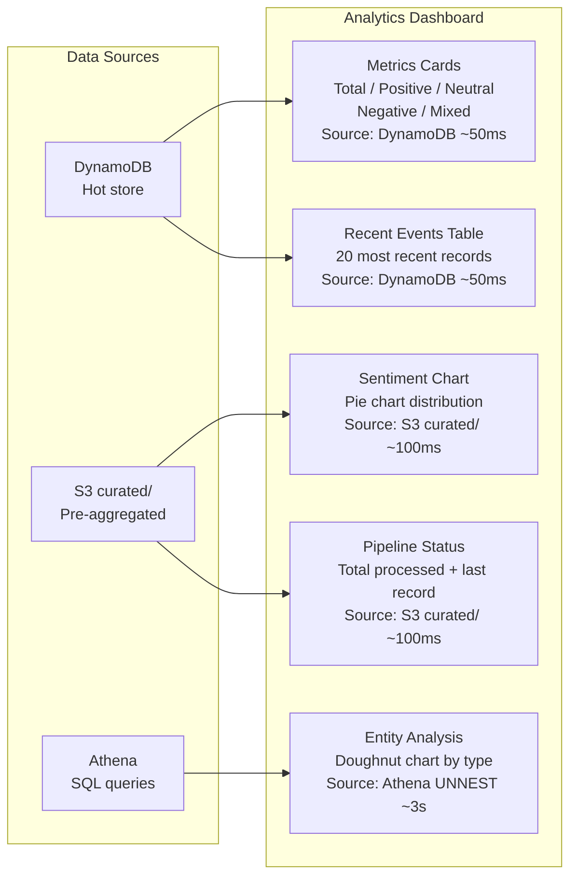

# Architecture Documentation

**AI-Powered Serverless Data Pipeline**
Last Updated: 2026-04-05

---

## Table of Contents

1. [High-Level Architecture](#high-level-architecture)
2. [Streaming Ingestion Path](#streaming-ingestion-path)
3. [Batch Ingestion Path](#batch-ingestion-path)
4. [Step Functions State Machine](#step-functions-state-machine)
5. [Storage Architecture](#storage-architecture)
6. [Analytics Layer](#analytics-layer)
7. [API Contract](#api-contract)
8. [Infrastructure Summary](#infrastructure-summary)
9. [Key Architectural Decisions](#key-architectural-decisions)

---

## High-Level Architecture



---

## Streaming Ingestion Path

Data submitted via the REST API is immediately ingested, normalized, and written to S3 within seconds. The ETL Lambda uses Kinesis sequence numbers as S3 filenames — guaranteeing idempotent writes on retry.



---

## Batch Ingestion Path

Files uploaded directly to S3 `raw/` trigger the same enrichment pipeline as streaming data — EventBridge is the convergence point for both paths.

```mermaid
sequenceDiagram
    actor Client
    participant S3 as S3 raw/
    participant EB as EventBridge
    participant SF as Step Functions
    participant Comprehend as Comprehend
    participant Merge as Merge Lambda
    participant S3P as S3 processed/
    participant S3C as S3 curated/
    participant DDB as DynamoDB

    Client->>S3: PutObject raw/{key}

    S3->>EB: S3 Object Created event
    EB->>SF: StartExecution

    SF->>SF: PrepareComprehendInput<br/>(extract bucket + key from event)
    SF->>S3: GetObject (read file contents)
    S3-->>SF: File body as text

    alt key ends in .json (streaming event)
        SF->>SF: ParseJsonEvent + CheckForText<br/>(score only the text field; no text = stop)
    else plain-text batch file
        SF->>SF: PrepareTextContent<br/>(whole body is the document)
    end

    par Parallel AI Analysis
        SF->>Comprehend: DetectSentiment (en)
        Comprehend-->>SF: {Sentiment, SentimentScore}
    and
        SF->>Comprehend: DetectEntities (en)
        Comprehend-->>SF: {Entities[]}
    end

    SF->>SF: FormatResults<br/>(merge sentiment + entities + metadata)
    SF->>Merge: InvokeLambda<br/>(source_object, ai_enrichment, processing_metadata)

    Merge->>S3: GetObject raw/ (fetch text preview)
    Merge->>S3P: PutObject processed/year=YYYY/month=MM/day=DD/{uuid}.json
    Merge->>DDB: PutItem (recordId, sentiment, entities, TTL=30d)
    Merge->>S3C: PutObject curated/latest_summary.json (running aggregate)

    Merge-->>SF: {statusCode: 200, processed_s3_key, dynamodb_record_id}
    SF->>SF: MergeComplete (Succeed)
```

---

## Step Functions State Machine

The state machine (`ai-dp-dev-orchestrator`) orchestrates the entire enrichment pipeline. The Parallel state runs both Comprehend calls simultaneously, cutting enrichment time roughly in half.



**Retry policy on ReadS3Object, DetectSentiment, DetectEntities:** errors a retry can't fix (`Comprehend.TextSizeLimitExceededException`, `InvalidRequestException`, `UnsupportedLanguageException`, `S3.NoSuchKeyException`, `S3.InvalidObjectStateException`) fail immediately; every other task failure (throttling, 5xx) retries 3 times from 2s with backoff 2.0 and full jitter.

**Retry policy on InvokeMergeLambda:**
- Errors: `Lambda.ServiceException`, `Lambda.TooManyRequestsException`
- Interval: 2s, MaxAttempts: 3, BackoffRate: 2.0

---

## Storage Architecture

The pipeline uses a three-tier S3 data lake pattern. Each layer serves a different purpose and has its own lifecycle policy.



### Data written per record

| Layer | Key Pattern | Contents | Retention |
|-------|------------|----------|-----------|
| `raw/` | `raw/year=Y/month=M/day=D/{sequenceNumber}.json` | Original payload + normalized fields | 180 days |
| `processed/` | `processed/year=Y/month=M/day=D/{uuid}.json` | Full enriched record with sentiment + entities | 365 days |
| `curated/` | `curated/latest_summary.json` | Running aggregate (overwritten each record) | Indefinite |
| DynamoDB | PK: `recordId`, SK: `timestamp` | Hot record with 30-day TTL | 30 days |

---

## Analytics Layer

The dashboard uses three data sources in parallel, each optimized for a different query type.



**Why three sources?** Each is the right tool for its job:
- **DynamoDB** — real-time data, last 30 days, sub-100ms latency
- **S3 curated/** — pre-aggregated by Merge Lambda on every write, no query cost
- **Athena** — complex SQL with `UNNEST` on nested arrays, demonstrates analytical SQL skills

---

## API Contract

### Streaming Ingestion Endpoint

| Property | Value |
|----------|-------|
| URL | `https://<api-id>.execute-api.us-west-2.amazonaws.com/ingest` |
| Method | `POST` |
| Protocol | HTTPS only (HTTP rejected) |
| Integration | API Gateway → Kinesis PutRecord (no Lambda proxy) |

**Request Headers**

| Header | Required | Description |
|--------|----------|-------------|
| `Content-Type` | Yes | Must be `application/json` |
| `X-Partition-Key` | Yes | Kinesis partition key (any string, e.g. device ID or `test`) |

**Request Body**

```json
{
  "event_type": "string (required)",
  "event_timestamp": "ISO8601 string (required, e.g. 2026-04-05T12:00:00Z)",
  "...": "any additional fields are preserved as-is"
}
```

**Validation rules (ETL Lambda):**
- `event_type` must be present and a string
- `event_timestamp` or `timestamp` must be present
- Invalid timestamps are replaced with current UTC time (logged as warning)

**Response**

```json
{
  "SequenceNumber": "49631234567890123456789012345678901234567890123456789012",
  "ShardId": "shardId-000000000000"
}
```

**Error responses**

| Status | Cause |
|--------|-------|
| `400` | Missing or invalid JSON body |
| `403` | Missing required headers |
| `500` | Kinesis service error |

---

## Infrastructure Summary

All resources deployed in `us-west-2` (except state bucket in `us-west-1`).

### Compute

| Resource | Name | Config |
|----------|------|--------|
| ETL Lambda | `ai-dp-dev-etl` | Python 3.11, 256MB, 60s timeout |
| Merge Lambda | `ai-dp-dev-merge` | Python 3.11, 256MB, 60s timeout |
| Step Functions | `ai-dp-dev-orchestrator` | Standard workflow, ALL-level logging |

### Ingestion

| Resource | Name | Config |
|----------|------|--------|
| API Gateway | `ai-dp-dev` | HTTP API, single POST /ingest route |
| Kinesis Stream | `ai-dp-dev-ingestion-stream` | 1 shard, KMS encrypted, 24h retention |
| EventBridge Rule | `ai-dp-dev-s3-batch-ingestion` | S3 Object Created → raw/ prefix filter |

### Storage

| Resource | Name | Config |
|----------|------|--------|
| S3 Data Lake | `ai-dp-data-lake-dev-us-west-2` | SSE-S3, versioning, TLS enforced |
| DynamoDB | `ai-dp-dev-enriched-data` | On-demand, TTL on `expiresAt`, PITR enabled |
| S3 State Bucket | `tf-state-aidp` | us-west-1, versioning, native TF locking |

### Analytics

| Resource | Name | Config |
|----------|------|--------|
| Glue Database | `ai-dp-dev-analytics` | Crawls S3 processed/ layer |
| Glue Crawler | `ai-dp-dev-crawler` | On-demand, UPDATE_IN_DATABASE schema policy |
| Athena Workgroup | `ai-dp-dev-workgroup` | Results → `ai-dp-athena-results-dev-us-west-2` |

### Observability

| Resource | Name | Config |
|----------|------|--------|
| CloudWatch Dashboard | `ai-dp-dev-operations` | 8 widgets: Lambda, Kinesis, Step Functions, DLQ, DynamoDB |
| CloudWatch Alarms | 5 alarms | Lambda errors, ETL DLQ depth, Kinesis lag, Step Functions failures |
| SNS Topic | `ai-dp-dev-cloudwatch-alarms` | Email subscription for alarm notifications |
| X-Ray Tracing | Active mode (both Lambdas) | Per-invocation latency timelines + downstream call segments (S3, DynamoDB, Comprehend) |
| SQS DLQ (ETL) | `ai-dp-dev-etl-dlq` | 14-day retention |
| AWS Budget | `ai-dp-dev-monthly-budget` | $50/month, alerts at 80% / 100% actual / 100% forecast |

### CI/CD

| Resource | Name | Config |
|----------|------|--------|
| OIDC IAM Role | `ai-dp-dev-github-actions` | Trust: `repo:CloudMikey/AI-DP:*`, no long-term keys |
| CI Workflow | `.github/workflows/ci.yml` | fmt + validate + tflint + tfsec + plan on every PR |
| Deploy Workflow | `.github/workflows/deploy.yml` | `terraform apply` on merge to main |
| GitHub Environment | `dev` | Protection rules, deployment history |

---

## Key Architectural Decisions

### Kinesis over SQS for streaming ingestion

Kinesis was chosen because this pipeline has three requirements SQS cannot satisfy:

**Replay.** Kinesis retains records for up to 7 days. If the ETL Lambda has a bug that corrupts data, you can fix the Lambda and replay the stream from any checkpoint. SQS deletes messages on successful consumption — no replay without external storage.

**Ordering.** Kinesis guarantees ordered delivery within a shard. For event streams where processing sequence matters (audit logs, clickstreams), out-of-order delivery can produce incorrect aggregates. SQS standard queues offer no ordering guarantee.

**Idempotent retry model.** Kinesis re-delivers the same record with the same sequence number on retry. This property is what makes the ETL Lambda's idempotent S3 write pattern possible — the sequence number doubles as a stable, deterministic filename. SQS message IDs are not guaranteed stable across retries.

The tradeoff: Kinesis costs more than SQS at low throughput and requires shard management. For this workload that's acceptable. At higher scale, Kinesis Enhanced Fan-Out would be the next step.

---

### API Gateway direct integration over Lambda proxy

The `/ingest` route calls `kinesis:PutRecord` directly via an API Gateway AWS service integration — no Lambda in the hot path. This was a deliberate choice:

- **Latency:** Eliminates a Lambda cold-start from the ingest path. API Gateway returns the Kinesis `SequenceNumber` directly to the caller in ~50ms.
- **Cost:** No Lambda invocation charge per request. At high ingest volume this is meaningful.
- **Failure surface:** Fewer components in the critical path means fewer places to fail or misconfigure.

The tradeoff: request validation is minimal at the gateway layer (only header and content-type checks). Field validation happens in the ETL Lambda after the record is already in Kinesis. Invalid payloads are caught and routed to the DLQ rather than rejected at the API boundary.

---

### DynamoDB over RDS for the hot store

DynamoDB on-demand billing was chosen over RDS for three reasons specific to this workload:

- **Traffic pattern.** Dev ingest traffic is bursty and unpredictable. On-demand DynamoDB scales to zero and charges per request — no idle RDS instance cost during quiet periods.
- **Schema flexibility.** Enriched records vary by event type and entity composition. DynamoDB's schemaless model accommodates this without migrations.
- **TTL.** DynamoDB's native TTL automatically removes records after 30 days, keeping the hot store bounded without scheduled cleanup jobs.

The tradeoff: no joins, no ad-hoc SQL. Complex analytical queries (e.g., `UNNEST` on entity arrays) run against Athena instead. This is by design — the dual-storage strategy separates hot operational queries (DynamoDB) from analytical queries (Athena).

---

### `use_lockfile = true` over DynamoDB state locking

Terraform >= 1.11.0 supports native S3 state locking via a `.tflock` file in the state bucket, enabled with `use_lockfile = true`. This replaces the previous pattern of provisioning a separate DynamoDB table solely for lock management.

```hcl
backend "s3" {
  bucket       = "tf-state-aidp"
  key          = "envs/dev/terraform.tfstate"
  region       = "us-west-1"
  encrypt      = true
  use_lockfile = true  # Native S3 locking — no DynamoDB table needed
}
```

**Why this matters:** The DynamoDB locking pattern requires bootstrapping a table before the first `terraform init`, adds a second AWS service dependency to every Terraform operation, and costs money at scale. Native S3 locking eliminates all three issues. For any project on Terraform >= 1.11.0, this is the correct default.
