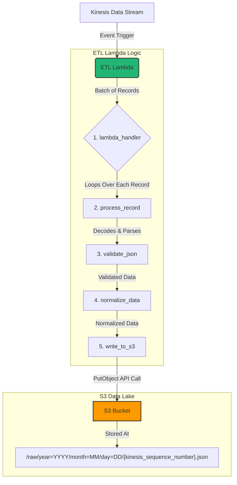

# ETL Lambda Data Flow Guide

This document outlines the complete data flow for the ETL Lambda function (`lambdas/etl/app.py`), which is responsible for processing the initial ingestion of data from the Kinesis Data Stream into the S3 Data Lake.

## Overview

The ETL Lambda's primary role is to act as a consumer for the Kinesis Data Stream. It extracts raw data records, transforms them into a standardized and validated format, and loads them into the `raw` layer of the S3 data lake. Its design emphasizes data integrity, query performance, and resilience.

## Data Flow Diagram

## Step-by-Step Process

The process begins when the AWS Lambda service invokes the `lambda_handler` with a batch of records from Kinesis.

### 1. Invocation (`lambda_handler`)

-   **Trigger**: The Lambda is triggered by new data arriving in the associated Kinesis Data Stream.
-   **Input**: It receives an `event` object containing a list of `Records`.
-   **Action**: The handler iterates through each record in the list and passes it to the `process_record` function for individual processing. It also tracks the count of successful and failed records.

### 2. Extraction & Decoding (`process_record`)

-   **Input**: A single Kinesis record.
-   **Action**: The data within `record['kinesis']['data']` is a **Base64-encoded string**. This step decodes it into a standard UTF-8 string, which is then parsed into a Python dictionary (JSON object).
-   **Flow**: `Base64 String -> Bytes -> UTF-8 String -> Python Dictionary`

### 3. Validation (`validate_json`)

-   **Input**: The decoded Python dictionary.
-   **Action**: This function acts as a data quality gate. It checks for the presence of mandatory fields, such as `event_type` and a timestamp (`event_timestamp` or `timestamp`).
-   **Outcome**: If a required field is missing, it raises a `ValueError`, immediately failing the processing for that record.

### 4. Transformation & Normalization (`normalize_data`)

-   **Input**: The validated Python dictionary.
-   **Action**: This function standardizes the data and enriches it with metadata.
    -   **Timestamp Standardization**: It ensures a consistent timestamp field named `event_timestamp`.
    -   **Metadata Enrichment**: It adds `processed_at` (the UTC timestamp of when this processing occurred), `lambda_name`, and `lambda_version`. This is crucial for data lineage and debugging.

### 5. Loading to S3 (`write_to_s3`)

-   **Input**: The final, normalized Python dictionary.
-   **Action**: This is the final step where the data is persisted.
    -   **Partitioning**: It generates an S3 key using a `year=.../month=.../day=...` structure based on the event's timestamp. This is critical for optimizing Athena query performance.
    -   **Idempotency**: It uses the unique **Kinesis Sequence Number** as the filename (e.g., `496...89.json`). If the Lambda re-processes the same Kinesis record due to a retry, it will overwrite the exact same file, preventing data duplication.
    -   **API Call**: It uses the `boto3` client to call the `s3_client.put_object` API, saving the data to the S3 bucket defined in the `DATA_LAKE_BUCKET` environment variable.

## Key Design Decisions

-   **Idempotency**: Using the Kinesis Sequence Number as the S3 object key is a deliberate choice to ensure that repeated processing of the same record does not create duplicate data in the data lake.
-   **Data Partitioning**: The `year/month/day` folder structure is not arbitrary. It aligns directly with how AWS Athena can partition data, leading to significantly faster queries and lower costs, as the query engine can prune (ignore) irrelevant folders.
-   **Error Handling**: If any step in `process_record` fails, the function raises an exception. This causes the entire Lambda invocation to fail, which signals to Kinesis that the batch was unsuccessful. Kinesis will then automatically retry the batch, and if it continues to fail, will send it to the configured Dead-Letter Queue (DLQ).
