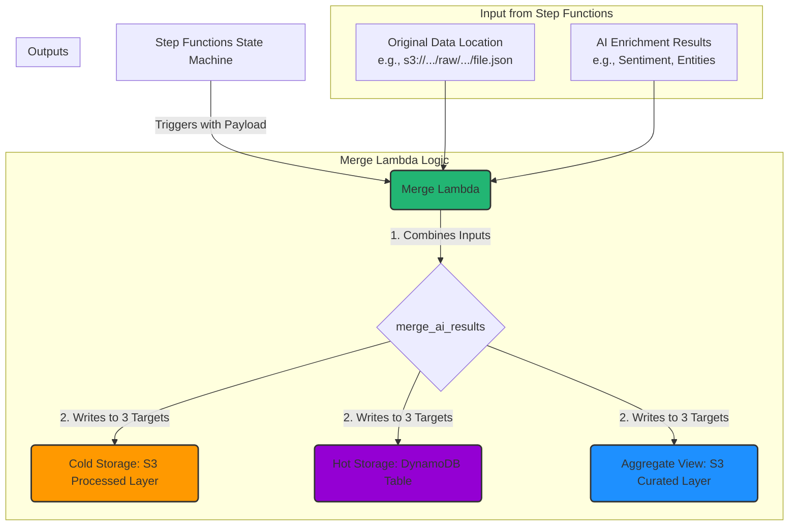

# Merge Lambda Data Flow Guide

This document outlines the data flow for the Merge Lambda function (`lambdas/merge/app.py`). This function serves as the final step in the enrichment pipeline, combining raw data with AI insights and distributing it to long-term and short-term storage.

## Overview

The Merge Lambda is orchestrated by an AWS Step Functions state machine. It is triggered after parallel AI enrichment tasks (e.g., AWS Comprehend) have successfully completed. Its core responsibility is to consolidate the original data and the various AI analyses into a single, cohesive JSON object. It then writes this final record to three distinct locations, each serving a specific purpose in the architecture.

## Data Flow Diagram

## Step-by-Step Process

### 1. Invocation from Step Functions

The process starts when the Step Functions state machine executes the Merge Lambda task. It passes a JSON payload containing the outputs from previous steps.

-   `source_object`: Contains the bucket and key of the original file in the `raw/` S3 prefix.
-   `ai_enrichment`: Contains a dictionary with the results from the AI services, such as sentiment scores and detected entities.

### 2. Merging Results (`merge_ai_results`)

The Lambda first consolidates all the disparate pieces of information into a single, enriched Python dictionary.

-   It fetches a short text preview from the original raw S3 file. This is an optimization for the dashboard, so it doesn't need to load large files just to show a snippet.
-   It cleans and structures the AI results into a user-friendly format.
-   It adds valuable processing metadata, like `recordId`, `mergedAt`, and the Lambda function version.

### 3. Writing to Destinations

The function then writes the merged data to three different locations in parallel.

#### A. Cold Storage (`write_to_s3_processed`)

-   **Target**: The `processed/` prefix in the S3 Data Lake.
-   **Purpose**: This is the permanent, long-term "source of truth" for the enriched data.
-   **Structure**: Data is saved in a date-partitioned format (`year=.../month=.../day=...`) to dramatically speed up and reduce the cost of subsequent Athena queries.
-   **Key Feature**: It uses a custom JSON encoder to prevent writing floats in scientific notation, which avoids `HIVE_CURSOR_ERROR` in Athena.

#### B. Hot Storage (`write_to_dynamodb`)

-   **Target**: The DynamoDB table specified by the `DYNAMODB_TABLE` environment variable.
-   **Purpose**: This provides fast, low-latency access to the most important data fields needed by the dashboard or for real-time lookups.
-   **Structure**: A subset of the full record is written, including fields like `sentiment`, `entities`, and the S3 locations of the raw/processed files.
-   **Key Feature**: It sets a Time To Live (`TTL`) attribute. This automatically purges old records from DynamoDB after a configured number of days, keeping the table small, fast, and cost-effective.

#### C. Curated Summary (`update_curated_summary`)

-   **Target**: A single JSON file (`latest_summary.json`) in the `curated/` prefix in S3.
-   **Purpose**: This serves as a pre-aggregated, business-level summary for instantaneous dashboard loading.
-   **Structure**: The function reads the existing file, updates running counts (e.g., total records, sentiment breakdown), and writes it back.
-   **Key Feature**: This is a major performance and cost optimization. The dashboard can fetch this one file instead of running a full-blown Athena query every time it loads, providing instant metrics to the user. This process is treated as non-critical; if it fails, a warning is logged, but the main Lambda execution still succeeds.
